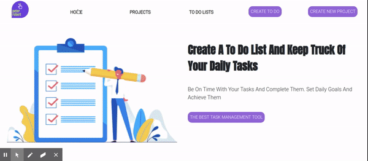

# Javascript-To-Do-List

> The aim of this project was to create a to do list using Javascript classes.I implemented the single responsibility principal.I also used fire base to store my data.




## Built With

- Javascript ES6
- WebPack
- HTML
- CSS
- Firebase (firestore)
- VS Code


## How to Install

- Install Node in your system. To install Node, you can read the [Documentation](https://nodejs.org/en/download/package-manager/)
- Clone or download the zip file into your machine. CD into the folder and run
    ``` 
   npm install

    ``` 
- This will install all the dependancies.

- Then open the index.html in your browser

- To see the live site check here

   [Live Demo Link](https://rawcdn.githack.com/peterrobert/javascript-to-do-list/f393dde6f4bb69c892154545580360ba120b1618/dist/index.html)


## Authors  

👤 **Peter Robert**

- Github: [@peterrobert](https://github.com/peterrobert)
- Twitter: [@ptahwambui93](https://twitter.com/Ptahwambui93)
- Linkedin: [Peter Robert Ndungu](https://www.linkedin.com/in/peter-rob-ndungu/)


## 🤝 Contributing

Contributions, issues and feature requests are welcome!. Feel free to check the [issues page](issues/).

## Show your support
